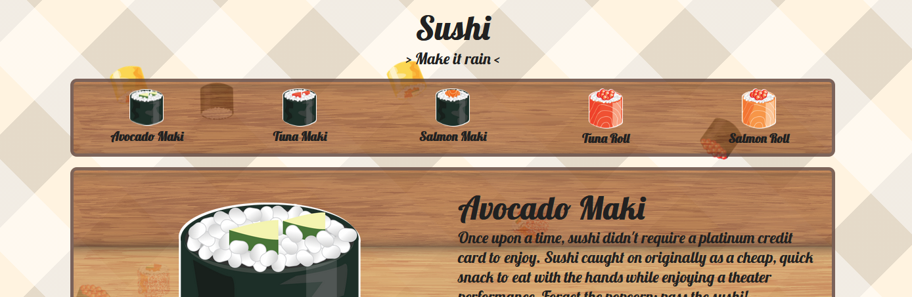

# CSSTTR1920 | Sushi menu

## Features
Users can click on each of the menu items to display it's description and price in the main content section. The page could also be printed out, showing only necessary elements. And clicking on the '> Make it rain <' button above triggers an animation.

## Process
First couple of weeks were spent creating a different concept which was eventually scrapped. The first concept would have been a history article, including a bunch of chaotic animations. During this period I experimented with the following features.

- Keyframe animations
- Offset-path animations
- SVG path making any path for an element to follow
- Triggering displays using radio/checks

Some of these were also used for the final concept.

## What did I learn?
- Keyframe animations
- Using grid
- Responsive grid without media queries
- Print media query
- Being more efficient with writing CSS